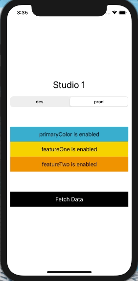

# FeatureFlag iOS README

## Description
- This is a sample SwiftUI app that utilizes Firebase RemoteConfig as well as UserDefaults for toggling feature flags in different environments. 
- The Prod environment will utilize Firebase RemoteConfig as the source of truth for showing/hiding features.
- The Dev environment will utilize UserDefault as source of truth for showing/hiding features.

## Usage
-  Create a Firebase account and download the `GoogleService-Info.plist` as described [here]( https://firebase.google.com/docs/remote-config/get-started?platform=ios)
- Import the `plist` to the project
- Add parameters as shown in the attached `png`. 
- Run the app

## Firebase RemoteConfig Setup

